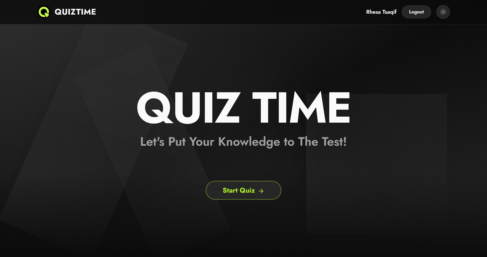
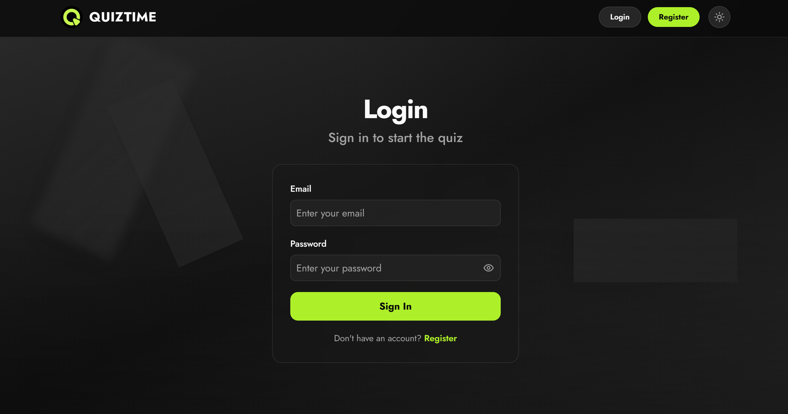
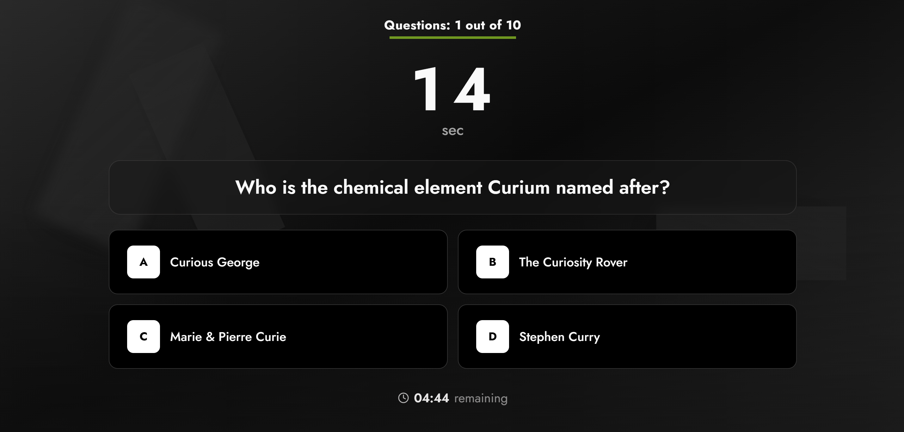
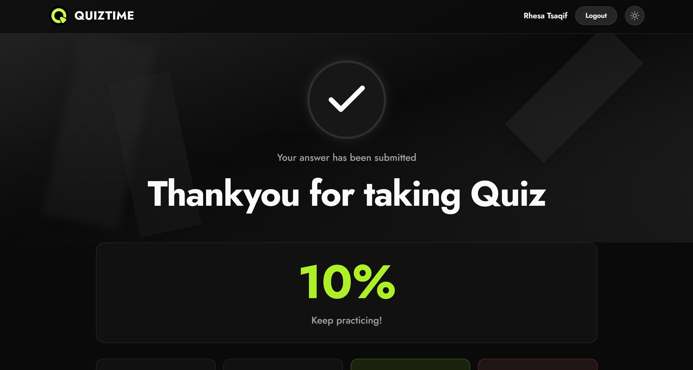

# QuizTime - React Quiz Application

A modern, feature-rich quiz application built with Next.js 16, TypeScript, and Tailwind CSS. Test your knowledge with questions from the Open Trivia Database API, complete with timers, progress tracking, and a sleek neon-green themed UI.

---

## Screenshots

<table>
  <tr>
    <td align="center">
      
    </td>
    <td align="center">
      
    </td>
  </tr>
  <tr>
    <td align="center">
      
    </td>
    <td align="center">
      
    </td>
  </tr>
</table>

---

## Features

- **User Authentication** - Register and log in with secure NextAuth v5 credentials-based auth (JWT + bcrypt password hashing)
- **Quiz Configuration** - Customize your quiz with:
  - 5 to 30 questions
  - 24 trivia categories (General Knowledge, Science, Music, etc.)
  - Difficulty levels (Easy, Medium, Hard)
  - Question types (Multiple Choice, True/False)
- **Per-Question Countdown Timer** - 30-second timer per question; auto-skips on timeout
- **Global Countdown Timer** - Tracks total quiz duration with automatic submission when time expires
- **Auto-Advance** - Select an answer and the quiz automatically advances after a 1-second visual feedback delay
- **Quiz Resume** - Quiz state is persisted to localStorage; resume an interrupted quiz from the homepage
- **Results & Review** - Detailed results page with:
  - Overall score percentage
  - Stats grid (total, answered, correct, incorrect)
  - Time taken
  - Per-question review with correct/incorrect indicators
- **Dark/Light Theme Toggle** - Switch between dark and light modes via the navbar
- **Animated 3D Background** - Floating geometric shapes with light beam and glow effects
- **Responsive Design** - Optimized for mobile, tablet, and desktop with a neon green (#b3ff00) accent color
- **HTML Entity Decoding** - Properly decodes special characters from the Open Trivia Database API responses

---

## Tech Stack

| Technology | Version | Purpose |
|---|---|---|
| **Next.js** | 16 | App Directory framework, server/client components |
| **React** | 19 | UI library |
| **TypeScript** | 5 | Static type checking |
| **Tailwind CSS** | 4 | Utility-first CSS styling |
| **shadcn/ui** | - | Pre-built UI components (Dialog, Select, RadioGroup, Slider, etc.) |
| **Base UI** | 1.6 | Headless component primitives (via shadcn) |
| **Radix UI** | 1.6 | Accessible component primitives |
| **NextAuth** | v5 (beta) | Authentication (Credentials provider) |
| **Prisma** | 5.22 | ORM for SQLite database |
| **SQLite** | - | Lightweight database for user storage |
| **bcryptjs** | 3.0 | Password hashing |
| **React Hook Form** | 7.79 | Form state management |
| **Zod** | 4.4 | Schema validation |
| **next-themes** | 0.4 | Dark/light theme management |
| **Sonner** | 2.0 | Toast notifications |
| **Lucide React** | 1.21 | Icon library |
| **Open Trivia Database** | - | Free quiz questions API |

---

## Getting Started

### Prerequisites

- **Node.js** 18+ (recommended: 20+)
- **npm** or **yarn** or **pnpm**

### Installation

1. **Clone the repository**

   ```bash
   git clone https://github.com/your-username/react-quiz-dot.git
   cd react-quiz-dot
   ```

2. **Install dependencies**

   ```bash
   npm install
   ```

3. **Set up environment variables**

   Create a `.env` file in the project root:

   ```env
   # Database
   DATABASE_URL="file:./dev.db"

   # NextAuth
   NEXTAUTH_URL="http://localhost:3000"
   NEXTAUTH_SECRET="your-secret-key-change-this-in-production"
   ```

   > **Important:** Generate a strong secret for production. You can use:
   > ```bash
   > openssl rand -base64 32
   > ```

4. **Initialize the database**

   ```bash
   npx prisma migrate dev
   ```

   This creates the SQLite database and applies the schema.

5. **Run the development server**

   ```bash
   npm run dev
   ```

6. **Open the application**

   Navigate to [http://localhost:3000](http://localhost:3000)

### Available Scripts

| Script | Description |
|---|---|
| `npm run dev` | Start development server |
| `npm run build` | Build for production |
| `npm start` | Start production server |
| `npm run lint` | Run ESLint |

---

## Project Structure

```
react-quiz-dot/
├── app/
│   ├── _components/                # Shared global components
│   │   ├── navbar.tsx              # Navigation bar with theme toggle
│   │   └── loading-spinner.tsx     # Global loading component
│   ├── (authenticated)/            # Protected routes (require login)
│   │   ├── quiz/
│   │   │   ├── _components/        # Quiz-specific components
│   │   │   │   ├── question-card.tsx
│   │   │   │   ├── quiz-timer.tsx
│   │   │   │   └── quiz-progress.tsx
│   │   │   ├── _const/             # Quiz constants
│   │   │   ├── _hooks/             # Quiz hooks
│   │   │   ├── _types/             # Quiz types
│   │   │   └── page.tsx            # Main quiz page
│   │   └── results/
│   │       ├── _components/        # Results-specific components
│   │       ├── _hooks/             # Results hooks
│   │       └── page.tsx            # Results page
│   ├── (public)/                   # Public routes
│   │   ├── _components/            # Shared public components
│   │   │   ├── quiz-config-dialog.tsx
│   │   │   └── quiz-config-form.tsx
│   │   ├── login/
│   │   │   ├── _components/
│   │   │   └── page.tsx
│   │   └── register/
│   │       ├── _components/
│   │       └── page.tsx
│   ├── api/
│   │   └── auth/
│   │       └── [...nextauth]/
│   │           └── route.ts        # NextAuth API route
│   ├── globals.css                 # Global styles + Tailwind
│   ├── layout.tsx                  # Root layout with providers
│   └── page.tsx                    # Homepage
├── components/
│   └── ui/                         # shadcn/ui components
├── common/
│   ├── constants/
│   │   └── trivia-categories.ts   # Categories, difficulties, types
│   ├── enums/
│   │   └── quiz-status.ts         # Quiz status enum
│   └── types/
│       └── quiz.ts                 # TypeScript interfaces
├── hooks/
│   └── use-auth.ts                 # Client-side auth hook
├── libs/
│   ├── auth.ts                     # NextAuth configuration
│   └── prisma.ts                   # Prisma client singleton
├── prisma/
│   └── schema.prisma               # Database schema
├── providers/
│   ├── auth-provider.tsx           # NextAuth SessionProvider
│   └── theme-provider.tsx          # next-themes ThemeProvider
├── utils/
│   ├── decode-html.ts              # HTML entity decoder
│   └── localStorage.ts             # localStorage utilities
├── types/
│   └── next-auth.d.ts              # NextAuth type extensions
├── middleware.ts                    # Auth middleware
└── screenshots/                    # App screenshots
```

---

## How It Works

### Quiz Flow

1. **Landing Page** - User sees the homepage with "Start Quiz" and optionally "Resume Quiz" buttons. An animated 3D background with floating shapes is displayed.

2. **Authentication** - Unauthenticated users are redirected to `/login`. New users can register at `/register`. Credentials are verified with bcrypt and stored in SQLite via Prisma.

3. **Quiz Configuration** - A dialog opens where the user selects:
   - Number of questions (5-30)
   - Trivia category (24 options)
   - Difficulty (Easy/Medium/Hard)
   - Question type (Multiple Choice/True/False)

4. **Fetching Questions** - Questions are fetched from the Open Trivia Database API (`https://opentdb.com/api.php`) with the chosen parameters. HTML entities in questions/answers are decoded.

5. **Taking the Quiz** - For each question:
   - A **30-second per-question timer** counts down. If it reaches zero, the question is skipped.
   - A **global countdown timer** shows the remaining total time for the entire quiz.
   - The user selects an answer. After selection, there is a **1-second feedback delay** before auto-advancing to the next question.
   - Quiz state is saved to **localStorage** after every state change, enabling resume functionality.

6. **Quiz Completion** - When all questions are answered or the global timer expires:
   - Results are calculated (score, correct/incorrect counts, time taken).
   - Quiz state is cleared from localStorage.
   - Results are saved to localStorage and the user is redirected to the results page.

7. **Results Page** - Displays:
   - Score percentage with a motivational message
   - Statistics grid (total, answered, correct, incorrect)
   - Time taken
   - Per-question review cards showing the question, your answer, the correct answer, category, and difficulty

### Authentication System

- **NextAuth v5** with the Credentials provider
- Passwords hashed with **bcryptjs**
- Session strategy: **JWT** (no database session storage)
- Auth middleware protects `/quiz` and `/results` routes
- Custom `useAuth` hook provides `user`, `isAuthenticated`, `isLoading`, and `logout` to client components

### State Management

- **React useState** for local component state (quiz state, timer, form inputs)
- **localStorage** for persistence across page reloads (quiz resume, results)
- **next-themes** for dark/light theme state
- **NextAuth session** for authentication state

---

## Contributing

Contributions are welcome! Please follow these steps:

1. **Fork** the repository
2. **Create** a feature branch (`git checkout -b feature/your-feature`)
3. **Commit** your changes (`git commit -m 'feat: add your feature'`)
4. **Push** to the branch (`git push origin feature/your-feature`)
5. **Open** a Pull Request

### Commit Convention

This project follows [Conventional Commits](https://www.conventionalcommits.org/):

```
feat(quiz): add timer functionality
fix(auth): handle expired JWT tokens
docs: update README
```

### Code Standards

- ESLint with recommended rules
- Prettier for formatting
- TypeScript strict mode
- PascalCase for components, camelCase for functions/variables
- kebab-case for file names

---

## License

This project is licensed under the **MIT License**. See the [LICENSE](LICENSE) file for details.

---

> Built with Next.js 16, TypeScript, Tailwind CSS, and Open Trivia Database API
